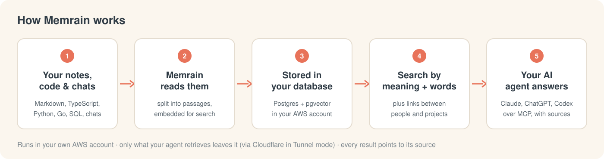

# How Memrain works

This page explains what Memrain does with your notes, how it answers a
question, and what it costs to run. The first sections need no setup
knowledge; the last ones are reference. For the setup
itself, see [QUICKSTART.md](./QUICKSTART.md).

<picture>
  <source media="(prefers-color-scheme: dark)" srcset="assets/how-it-works-dark.svg">
  
</picture>

## In one minute

Memrain is a memory, not a chatbot. It reads your notes, code and chat history,
remembers them, and when your AI agent asks a question it hands back the most
relevant passages, each with the page it came from. Your agent (Claude Code,
ChatGPT, Codex and so on) writes the answer from that evidence. The one
exception is the opt-in `think` tool, which writes a cited answer itself.

## 1. How your knowledge gets in

You point Memrain at your content: a folder of markdown notes, a code checkout,
or anything your agent saves through MCP. For each document it:

1. **Splits** it into short passages.
2. **Embeds** each passage: Amazon Titan on Bedrock turns it into a list of
   numbers that captures its meaning, so "car" can find "vehicle".
3. **Stores** everything in Postgres in your AWS account. The database is the
   record, not the files on disk.

Chat history comes in the same way. `memrain transcripts ingest` reads ChatGPT
and Claude.ai exports, Codex CLI rollouts (`~/.codex/sessions`) and Claude Code
session logs (`~/.claude/projects`), one file or a whole directory. It keeps
only what was said: tool calls and results, reasoning, sub-agent traffic and
system reminders are dropped, credentials are redacted, and a long session is
split into parts at message boundaries. Running it again on unchanged input
writes nothing.

## 2. How a question is answered

When your agent searches, Memrain:

1. **Works out what kind of question it is** (about a person or thing, a time
   span, an event, or general),
   with simple rules and no model call by default.
2. **Searches two ways at once**: by meaning, using the embedding of the
   question, and by exact words.
3. **Merges the two result lists** into one ranking, then favours the right
   kind of source and removes near-duplicates.
4. **Optionally reorders the top results** with a Claude model, if you turned
   that on.
5. **Returns the top passages, each with its source.**

A default search makes one Titan embedding call and no Claude call. Asking a
model to classify the question (`MEMRAIN_INTENT_LLM=1`), expanding the query
with related words (`MEMRAIN_QUERY_EXPANSION=1`) and reranking
(`MEMRAIN_RERANK=1`, or the paid Sonnet `MEMRAIN_GRAPH_RERANK=1`) are all
opt-in. When they are on, they improve which passages come back. They never
write the answer. The code is in `deploy/memrain/src/core/search/hybrid.ts`;
the two lists are merged with Reciprocal Rank Fusion.

One optional shortcut sits in front of all of this: a cache that recognises a
question you asked before, or a close paraphrase, and returns the earlier
result instead of searching again. It is off by default.

## 3. Where the money goes

Three cost layers, from pennies to real money:

| Layer | What it does | When it spends | Cost |
|-------|--------------|----------------|------|
| **Titan embeddings** | chunk fingerprints | on indexing + one query vector per search | pennies (~$0.026 / 1M tokens) |
| **Claude Haiku** (utility) | query intent / expansion / rerank only when `MEMRAIN_INTENT_LLM` / `MEMRAIN_QUERY_EXPANSION` / `MEMRAIN_RERANK` are on (the Balanced and Max tiers written by `scripts/init.sh` turn `MEMRAIN_RERANK` on); nightly synthesis; contextual embedding wrapper | only when those flags are on | cheap (~$1–15/mo) |
| **Claude Sonnet** (paid slices) | graph-aware rerank, relational reasoning, `think`, deep-synth, take grading | **only when a flag is set** | pay-per-call — the cost swing |

The dominant variable cost is **`MEMRAIN_GRAPH_RERANK`** — a paid Sonnet call on
*every* search, so it scales with how much you search. On top of that sits a
fixed infrastructure floor: one small EC2 instance + one RDS Postgres +
networking/secrets. See [CONFIGURATION.md](./CONFIGURATION.md#quality--cost-tiers-pick-one)
for the Free / Balanced / Max tiers and how to pick one.

The tier that `scripts/init.sh` picks (Balanced or Max turn `MEMRAIN_RERANK` on)
is written only to your local `.env`. A Terraform host runs the free tier until
you copy that block into the host's `.env`; see
[DEPLOYMENT.md](./DEPLOYMENT.md).

## 4. Why run LLMs *inside* the brain at all?

If the MCP client writes the answers, why does Memrain call models internally? Two
reasons — and neither is "chatting with the user":

**A. Sharper retrieval, at query time.**
- **Graph rerank** (Sonnet): reorders the top hits using the knowledge-graph
  connections between pages — the most relevant, best-connected hit rises.
- **Relational fallback** (Sonnet): kicks in only for relationship questions
  ("who founded X") when plain hybrid search underperforms.

**B. A knowledge layer, built in the background.**
- **Synthesis** (`MEMRAIN_DREAM_SYNTHESIS`, Haiku): on quiet-hours ticks the brain
  distils your notes into concepts, opinions ("takes"), and a calibration profile
  — stored in a *separate* store; your original notes are never touched.
- **Deep synthesis / take grading** (Sonnet): deepen and score those takes.
- **Facts** — Memrain pulls concrete claims ("Acme's contract renews in March") out
  of what you write, as you write it, and keeps them tidy: names are matched back
  to the right page instead of spawning duplicates, and a superseded claim is
  retired when a newer one lands. You can also *declare* facts yourself in a
  `## Facts` block on a page — those claims are yours, and the brain won't quietly
  drop them even as it prunes its own.
- **Reflections, then patterns** — over your recent sessions the brain writes short
  **reflections** (what happened, what was decided), then makes a second pass that
  reads across many reflections and surfaces the **patterns** — themes that keep
  recurring — as their own pages. Both are paid and off by default; reflections
  feed the pattern pass, so a run does both in order.
- **`think`** (Sonnet): an on-demand "reason deeply about this question" command
  that returns a synthesized, cited answer. For a *time* question ("when did X
  change, is it still true?") it figures out which entities you mean even if you
  didn't name one, and pulls in each one's **trajectory** — the log of how that
  thing changed over time — so the answer reflects the latest state, not a stale
  snapshot.
- **Contextual embeddings** (`MEMRAIN_CONTEXTUAL_LLM`, Haiku): before fingerprinting
  a chunk, prepend a short blurb situating it in its document ("from the note about
  the Acme deal…") so an otherwise-ambiguous chunk is found more reliably.

So internal models make search *more accurate* and let the brain *understand its
own content* — the final answer is still written by your MCP client using what was
retrieved.

## 5. One brain, scoped credentials — for one person or a team

A fresh install serves one person, and that is still the common case.
What makes more than one person possible is that **nothing trusts the caller**:
every remote credential (OAuth client or PAT) carries a write source and a
`federated_read` set, and reads and writes are confined to that grant. A leaked
app token never exposes the whole brain. Operational tools (`stats`, `advisor`,
the job queue) are operator-only regardless.

A **source** is the unit of separation, one per person. Search, page reads,
writes, tag checks and even the page counters all follow the caller's grant.

Where the grant comes from is the part worth knowing:

- normally from the **client row**, so one connector means one tenant;
- or from the **authorisation itself**, when the client is in *enrollment mode*.
  The operator issues a one-time code per person; the person presents it once
  at `/authorize`; that single authorisation is pinned to their source and the
  refresh token carries the pin. One connector, many people, separate tenants.

That second path exists because Claude Team and Enterprise let only an Owner
add a connector, once, for the whole organisation, and everyone authorises
against that same client. See
[CONFIGURATION.md](./CONFIGURATION.md#connecting-a-whole-team-through-one-connector).

## 6. The shape (and why)

Memrain is deliberately small: **one Docker container on one EC2 instance**, an
**RDS Postgres** for the index, an **EFS** mount for config that survives rebuilds,
and **AWS Secrets Manager** for the tokens. The public surface is `POST /mcp`, the
authenticated `POST /ingest`,
`GET /health`, the OAuth discovery and flow endpoints, and `/admin` (behind
its own sign-in), reached through a **Cloudflare Tunnel** — no load balancer, no
extra AWS ingress. (If you'd rather not depend on Cloudflare, the Caddy ingress
mode serves the same route over Let's Encrypt TLS on the instance's own IP; see
[DEPLOYMENT.md](./DEPLOYMENT.md#alternative-caddy-ingress-no-cloudflare).) It fits
on one small box and you can read the whole thing in an afternoon. Full topology
in [ARCHITECTURE.md](../ARCHITECTURE.md).

## 7. It maintains itself

A background cycle runs every few hours: it indexes new content, re-embeds stale
documents, and (during quiet hours) runs the synthesis layer — distilling takes,
writing reflections, and mining the patterns across them. It's careful not to
waste effort: editing one line of a page re-embeds only the chunk that changed,
not the whole document, and it won't turn its own reflections and patterns back
into raw input for another pass. You don't schedule anything; Memrain keeps
itself current.

Atom extraction replaces its active generation only after a complete response
and successful publication. It retires only unchanged, proven automatic pages
from the prior completed generation, keeping their history. Manual edits,
ambiguous legacy pages and partial model responses remain held. The explicit
`atoms-retire` preview can inspect historical candidates; deploying does not
apply it. See [maintenance previews](CONFIGURATION.md#explicit-maintenance-previews).

And it can check its own work. An opt-in nightly **eval probe** (runs only
after you install and enable `memrain-eval-probe.timer` from `deploy/systemd`)
runs a fixed set of questions against the brain and records how good the
retrieval was, so quality drift shows up as a trend you can read
(`memrain doctor`) rather than a surprise. It runs under a spend ceiling, so the
self-check can't run up a bill.

## 8. Under the hood: the tools

Memrain's MCP tools are declared in `deploy/memrain/src/mcp/operations.ts`; the
table below groups all of them. Each carries MCP `annotations` derived from its
scope: `readOnlyHint` on reads, and `destructiveHint` / `idempotentHint` on
writes, so a client can ask before it changes anything. The static public
bearer sees only a read subset; a personal access token or an OAuth client sees
what its scopes allow.

| Group | Tools |
|-------|-------|
| **Search & pages** | `search`, `query`, `think`, `recall`, `volunteer_context`, `context_pack`, `context_delta`, `advisor`, `index`, `get_chunks`, `resolve_slugs`, `page_put`, `page_append`, `page_get`, `page_list`, `page_versions`, `page_revert`, `page_delete`, `page_restore`, `purge_deleted_pages`, `add_tag`, `remove_tag`, `get_tags`, `put_raw_data`, `get_raw_data`, `get_recent_transcripts` |
| **Code** | `code_def`, `code_refs`, `code_callers`, `code_callees`, `code_blast`, `code_flow` |
| **Facts, timeline & chronicle** | `add_fact`, `forget_fact`, `extract_facts`, `fact_supersessions`, `add_timeline_event`, `chronicle_day`, `chronicle_since`, `chronicle_on_this_day`, `chronicle_last_seen`, `chronicle_backfill`, `volunteer_chronicle`, `ontology_get`, `ontology_propose`, `ontology_dimensions`, `ontology_conflicts` |
| **Graph & entities** | `backlinks`, `link`, `unlink`, `get_links`, `list_link_sources`, `graph_neighbors`, `graph_query`, `traverse_graph`, `relational_recall`, `entity_facts`, `entity_timeline`, `entity_recall`, `find_orphans`, `wanted_pages`, `find_experts`, `find_contradictions`, `find_trajectory`, `find_anomalies`, `get_recent_salience`, `list_concepts` |
| **Takes** | `list_takes`, `takes_search`, `takes_add`, `takes_update`, `takes_resolve`, `set_take_status`, `takes_scorecard`, `takes_calibration`, `get_calibration_profile` |
| **Jobs & agents** | `jobs_submit`, `jobs_cancel`, `jobs_list`, `jobs_get`, `jobs_logs`, `retry_job`, `get_job_progress`, `submit_agent`, `get_agent_job` |
| **Skills** | `list_skills`, `get_skill`, `list_brain_skillpack` |
| **Admin & diagnostics** | `stats`, `whoami`, `get_brain_identity`, `get_status_snapshot`, `run_doctor`, `source_health`, `sources_list`, `sources_status`, `log_friction`, `log_ingest`, `get_ingest_log`, `quarantine_list`, `extraction_review` |

A few that are easy to miss:

- Search hits include `source_id`, a `date` (YYYY-MM-DD when known), and
  `date_source` (`effective` or the `updated` fallback). When snippet capping
  is enabled, the `full` pointer supplies both `slug` and `source_id` to
  `page_get`; the requested source only narrows your existing read grant.
- `search` and `query` accept `types` (up to 20 page types) and `slug_prefix`.
  These filters match live canonical pages and their body, truth and relative
  markdown-file mirrors in the same source. Unmapped files and code documents
  are excluded when page filters are requested. Filtering runs before each
  retrieval limit and also applies to alias injection and query refinement.
  An unknown type produces `unknown_page_types` with available types in the
  caller's scope. Omit both filters to search the whole accessible corpus.
- `search`, `query` and `page_list` accept `source_ids` to narrow the caller's
  source grant for that call. Omitting it keeps the full grant; `[]` reads
  nothing, `null` is invalid, and any forbidden source rejects the request
  before retrieval or inference. Cached results, refinement, supplementary
  facts and response metadata use the same narrowed scope.
- Successful page writes return `admin_url` for operators and credentials with
  admin scope when the issuer is configured. The link opens the resulting page
  in the admin panel; tenant and public responses omit it.
- `page_get` returns small bodies whole. A body over 256 KiB, or an explicit
  `offset`/`max_bytes` request, returns `page.body_window` instead of
  `markdown_body`, with byte offsets, `total_bytes`, `partial`, `next_offset`
  and a bounded heading list. Follow `next_offset` until it is null. Windows
  never split a UTF-8 character; use `page_edit` or `page_append` for changes.
- `page_get` with `version` reads that stored body, compiled truth and hash,
  with `written_at` and `current_version` identifying the snapshot. Page title
  and identity metadata remain current; current access and quarantine rules
  still apply. A missing snapshot returns `version_not_found`.
- `page_list` accepts a literal `slug_prefix` (`projects/x/` for that subtree).
  Follow `next_cursor` with the same filters, sort and source access until
  `complete:true`. The cursor preserves timestamp precision and breaks ties
  by slug; hidden diary rows do not consume the visible limit. It is a live
  listing, so edits between requests can change the remaining results.
- `page_rename {from, to, expected_version}` moves a page with its history,
  facts, links, tags and timeline, and redirects the old slug. The version is
  checked under the write lock. Imported pages are refused, including a page
  edited manually after import: rename it upstream. The old search mirror is
  removed atomically; the next cycle indexes the new slug. Both names must be
  within your write grant. CLI: `memrain rename <from> <to> --expected-version N
  [--source ID]`.
- `page_versions` returns version metadata by default; `include_body:true`
  adds authorized snapshots. `page_list` keeps its full-body default and
  accepts `include_body:false` for metadata only. `get_chunks` returns at most
  200 chunks; when `truncated` is true, increase `from_index` by the number
  returned to read the next portion.
- `page_put`, `page_edit`, `page_delete` and `page_revert` accept an optional
  one-line `reason` of at most 500 Unicode code points after trimming whitespace.
  Longer input is refused, not truncated; blank input becomes `null`. It follows the same
  secret policy as page content and appears as `change_reason` in authorized
  version history. A reason alone does not create a version. Reverting records
  the reason for the new operation rather than copying the old reason. Public
  history and remote quarantined history omit this field.
- `page_put`, `page_edit`, `page_append` and successful `page_restore`/
  `page_revert` can return `superseded_rows`:
  bounded fact-fence row numbers whose exact claims remain superseded. The
  page text and history are retained. Suppression requires the same source,
  page, non-null row number and exact claim; a corrected number or a claim
  deliberately moved to a different row is not suppressed by that match.
- `takes_add`, `takes_update` and `takes_resolve` change one canonical takes
  row in its owning page and project it to the ledger in the same transaction.
  They require `expected_version`, source/prefix access and holder permission;
  the static public bearer cannot call them. `dry_run:true` previews the bounded
  row diff without writing or calling a model. Repeat the inputs with the
  preview's `plan_hash` to pin an apply. A resolution's server timestamp may
  change its applied `after_hash`; the plan still pins the requested operation.
  Claim edits clear the previous resolution and require a grade for the new
  claim text; earlier grades, other rows and history remain stored.
  External preview text retains its trust frame. See the
  [take-write API](../deploy/memrain/docs/API.md#canonical-take-writes).
- `add_fact` accepts `valid_from`, `kind`, `notability` and
  `claim_metric`/`claim_value`/`claim_unit`/`claim_period`. A batch inherits
  these top-level defaults and each item may override them. Metadata is
  validated for the whole batch before any item is written. `valid_from`
  timestamps become UTC dates; attribution and expiry are not caller-settable.
- A bare `add_fact.entity_slug` resolves to one existing page in the caller's
  write source and reports `entity_resolved_from`. An unresolved or ambiguous
  name remains unchanged with `entity_unresolved` and up to five candidates;
  qualified slugs remain explicit soft references. Doctor's
  `facts-without-entity-pages` check reports live facts whose entity has no live
  page in the same source. It does not create pages or rewrite facts.
- `find_contradictions {mode:"typed"}` finds different numeric values for
  the same entity, speaker, metric, unit, period, source and start month when
  their validity intervals overlap. Values remain exact decimal strings.
  It requires explicit dates and typed claim fields, infers no dates or unit
  conversions, and calls no model. Omitting `mode` keeps the existing asserted
  edges and cached probe findings.
- Manual `link` writes accept inclusive `valid_from` and exclusive
  `valid_until` dates. Omission preserves a stored bound; a bound can first be
  assigned or repeated, but cannot be changed or cleared. `graph_neighbors`,
  `graph_query`, `traverse_graph` and `get_links` accept `status` (`all`,
  `active`, `expired`, `future`) and, for a filtered status, optional `as_of`.
  Without a status they keep all links as before. Filters apply before limits
  and every traversal hop, using one UTC day throughout the request.
- New link-target formation preserves non-Latin letters in mixed-script
  segments while retaining the existing Latin-only behavior. Stored slugs are
  not renamed. Doctor's `mixed-script-targets` check reports bounded old/new
  examples and ambiguity; exact legacy keys still resolve.
- A failed retrieval stage is reported alongside surviving results. `search`
  and `query` expose `meta.degraded`; `think`, `context_pack` and
  `volunteer_context` expose `gather_degraded` when a collector fails. Direct
  database reads return retryable `db_timeout` or `db_busy` errors instead of
  reporting an empty collection after a transient database failure.
- Quarantined pages retain their metadata and a verdict. Remote page reads,
  listings, version history and entity recall withhold their body and compiled
  truth (including version snapshots). Operators can inspect the content;
  admin-scoped readers can request it explicitly through `page_get`.

- `search`, `query`, `get_chunks`, `think` evidence and `context_pack` label
  external source text with `trust: "external"` and an escaped
  `<external_content>` frame. GitHub/mailbox/calendar/webhook sources and
  recorded non-operator contributors mark text external; facts inherit their
  origin's provenance. A later edit does not erase earlier provenance. Frame
  characters count toward the response budget. Stored bodies, `page_get` and
  operator transcripts keep their original text.
  PAT and OAuth writes record a client principal, including an operator's
  client credential, so their retrieved evidence receives this frame too.
  Admin scopes do not certify client-supplied content as operator-authored.
- Search and query hits carry `generated:true` only when their current
  same-source canonical version proves an internal generator and operator
  principal, matching snapshots, hash and chunk content. Unknown legacy or
  spoofed provenance gets no generated marker. This metadata does not alter
  ranking or the external-content trust rules.
- Empty `search` and `query` results include a `hint`: `retrieval_healthy`
  suggests broader terms or filters, `retrieval_degraded` names pipeline
  failures, and `grant_sources_empty` means the caller has no readable source.
  Hints reveal no sources outside the caller's grant. Normal `query` with a
  `token_budget` and no explicit `k` considers up to 100 hits; without a budget
  it keeps the default 20. Explicit `k` and legacy `refine` keep their widths.
- `search_exact {phrase, case_sensitive?, slug_prefix?, type?, limit?}` finds
  literal text in live page bodies and compiled truth. Each match has one
  bounded snippet. `complete:true` means every match was returned; `false`
  identifies a result limit or timeout. `scanned` counts eligible pages,
  excluding out-of-scope, deleted, quarantined and remote diary pages. It is
  `null` after a timeout because the completed scan count is unknown. The
  database scan has a two-second deadline and uses no embeddings.
- `resolve_slugs {query, exact:true}` uses equality on slug, title, basename,
  declared aliases and structured email fields. It reports ambiguity even with
  `limit:1`; typo matching remains the default when `exact` is omitted.
  `referenced_by_count` counts distinct visible referring pages in the caller's
  source scope, without counting duplicate edge types or hidden diaries.
- `list_skills {query, limit}` selects skills by task, matching slug,
  description and triggers. An exact slug ranks first; ties keep catalog
  order. With a query it returns up to five skills by default. Without
  arguments the complete catalog is unchanged. Tool availability in each
  entry still reflects the caller's grant.
- A skill with `prompt: true` frontmatter can appear in MCP `prompts/list`
  when all its declared tools are available to the caller. `prompts/get`
  returns its literal Markdown without arguments or execution. No bundled
  skill opts in by default, and public callers receive no prompt access.
- `context_pack` builds a "what matters now" pack for the start of a turn:
  entity cards (title, type, top facts, recent events) for the slugs you name or
  the entities a conversation window mentions, then the top facts across your
  grant, trimmed to a token budget. No LLM, read-only.
- `context_delta {since, limit?, source_ids?}` returns recent page metadata,
  facts and events within your read grant. Each section has its own limit
  (default 20, maximum 100), `truncated` flag and `time_basis`. Pages use their
  update time, facts their write time, and events their UTC event date, which
  can include earlier hours of the requested day. It is bounded recent
  context, not a complete change log or snapshot. It preserves source,
  quarantine and remote diary restrictions, with no retrieval touches or LLM
  calls; the static public bearer cannot call it.
- Operators can use `quarantine_list` to inspect held document IDs, sources,
  paths and fixed reason codes without receiving bodies or free-form details.
  `extraction_review` proposes missing entity pages and similar fact pairs
  from at most 200 recent eligible facts, returning only IDs, slugs and
  similarity metadata. Both default to 20 results (maximum 100), can narrow
  by `source_ids`, and report truncation. Neither writes data, queues work,
  merges facts or calls a model; an admin scope alone does not grant access.
- `get_recent_transcripts` lists recently ingested meeting, email, journal and
  note pages, newest first, with a short summary or the capped body. It is not
  on the public ingress.
- `add_timeline_event` returns the stored `row` with UTC timestamps, including
  the original row when a retry is deduplicated. The top-level `id` remains
  `null` on a duplicate. Read restrictions still apply to the row; diary or
  out-of-source rows are withheld. Corrections are new events, as explained
  by `correction_hint`; existing timeline rows are not overwritten.

- Writes are safe to retry and to race. `page_put`, `page_append`, `add_fact`
  and `add_timeline_event` take an optional `request_id`: a retry with the same
  id and arguments returns the first result with `replayed: true` and writes
  nothing, so a timed-out append retried by a client does not land twice.
  `page_put`, `page_revert` and `page_delete` take an optional
  `expected_version` (from `page_get`): the write lands only if the page is
  still at that version, so of two writers that read the same version exactly
  one commits and the other gets `version_conflict`.
- `submit_agent` queues a read-only research agent that runs under your own
  grant, sources and daily budget, and `get_agent_job` returns its status and
  answer. Both need the `agent` scope, a daily budget on the client, and
  `MEMRAIN_AGENT_ENABLED=1` plus `MEMRAIN_AGENT_TENANT_ENABLED=1` on the host.

## MCP response metadata

With `MEMRAIN_HOT_MEMORY_META=1`, successful unscoped operator tool calls can
carry `_meta.brain_hot_memory`: up to ten recent live facts from the last
72 hours, ranked by confidence and age. This is out-of-band MCP metadata,
independent of the `hot_memory` tool. Clients decide whether to use it.
Public, tenant-scoped, and admin-panel calls never receive this payload.
It is disabled by default, cached briefly, and best-effort: a metadata failure
does not fail the underlying tool call. No recent facts means no payload.

Operator calls that actually start metered inference requests also carry
`_meta.cost`: `calls`, `known_usd`, `unknown_calls` and `usd`. The total is
`null` while any cost remains unknown, including pending, timed-out or unpriced
calls; known amounts remain visible separately. Parallel requests stay
separate, and calls with no metered request omit the field. Tenant and public
responses do not expose it.

For operators, `search` and `query` with `explain:true` add
`meta.timings_ms` and `meta.pending_embeddings`. Timings are monotonic stage
intervals for that request. A query with `refine` measures its two searches and
fusion together as `refinement`, then response preparation as `projection`,
and counts pending embeddings once. Pending embeddings count eligible visible chunks
within the source/filter scope, excluding code, intentionally skipped,
quarantined, deleted and archived content; `null` means the count was
unavailable. These diagnostics are omitted for tenant and public callers.
Tool-result JSON uses compact whitespace; field values and numeric precision
are unchanged by serialization.
